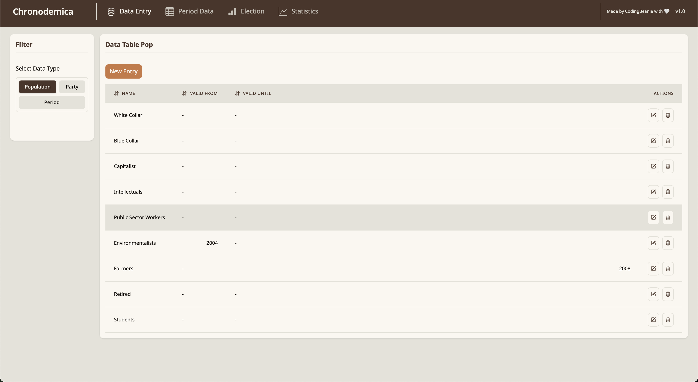
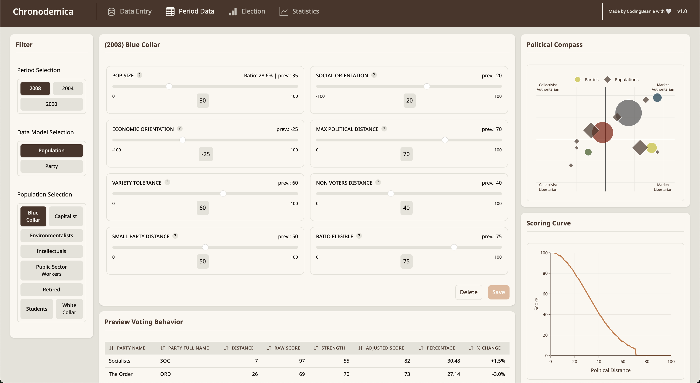
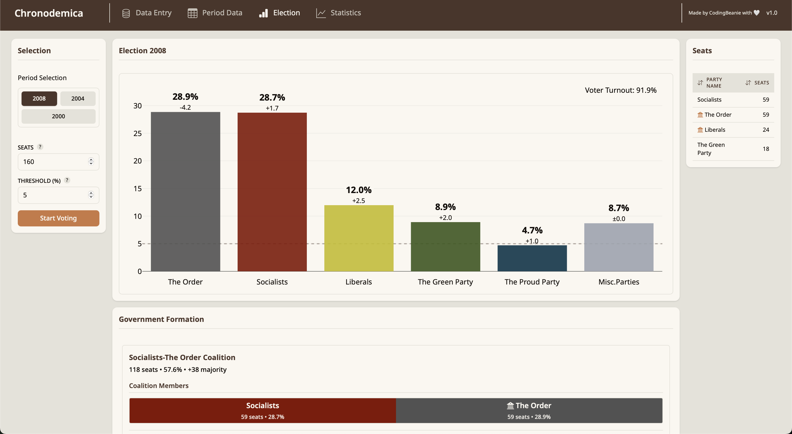

# Chronodemica

Chronodemica is a local web application for simulating and visualizing fictional election results. This hobby project allows you to create different population groups with varying political orientations, define political parties, and simulate election outcomes based on a political compass system with social and economic axes.

**This is a local web application** - it runs entirely on your machine using a local database (SQLite) and is not intended for hosting at this time.

## Features

### 📊 Data Management
Create and manage different periods, population groups (Pops), and political parties with customizable parameters.



*Data Entry page showing population groups like White Collar, Blue Collar, Capitalist, Intellectuals, etc. with validity periods*

### ⚖️ Political Compass System
Configure population groups and parties with detailed parameters including:
- Social Orientation (-100 to +100)
- Economic Orientation (-100 to +100)
- Population size, voter turnout, and political distance tolerances



*Period Data page showing detailed configuration for the "Blue Collar" population in 2008, including political compass visualization and voting behavior preview*

### 🗳️ Election Simulation
Run election simulations based on the configured parameters and visualize results with:
- Vote share percentages and seat distributions
- Government formation with coalition possibilities
- Comparison to previous periods (showing changes)



*Election 2008 results showing party vote shares, seat distribution, and government coalition formation between Socialists and The Order*

### 📈 Statistics & Visualization
- **Party Results Over Time**: Track how party vote shares evolve across periods
- **Population Voting Behavior**: Analyze how specific population groups vote over time
- **Population Composition**: Monitor changes in population group sizes

## How to Run

### Quick Start (Recommended)
```bash
./start.sh
```

This script automatically starts both backend and frontend services with live logs.

### Manual Setup
1. **Backend**: Navigate to `backend/`, activate virtual environment (`source venv/bin/activate`), then run `uvicorn main:app --reload --host 127.0.0.1 --port 8000`
2. **Frontend**: Navigate to `frontend/`, install dependencies (`npm install`), then run `npm run dev`

### URLs
- **Frontend**: http://localhost:5173
- **Backend API**: http://localhost:8000
- **API Documentation**: http://localhost:8000/docs

For detailed setup instructions and troubleshooting, see [startguide.md](startguide.md).

## Technology Stack
- **Frontend**: Svelte + SvelteKit with Tailwind CSS
- **Backend**: FastAPI with SQLModel
- **Database**: SQLite (local)
- **Visualization**: Plotly.js